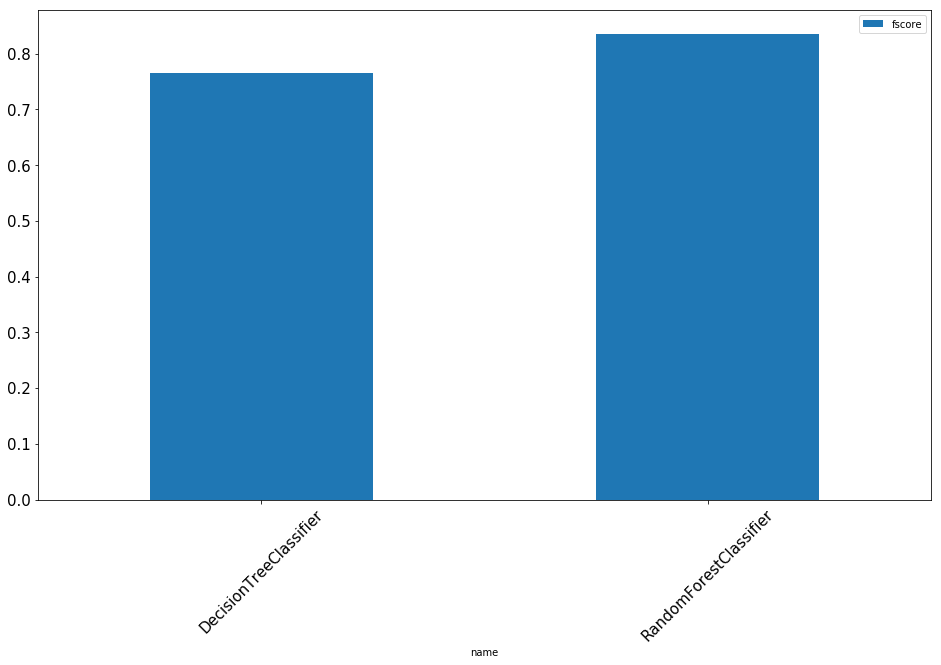

## Loan Performance (Delinquency prediction)
##### Using Pytorch and Multi-Layer Perceptron Network to predict whether a loan will fall delinquent by 1 or more months.
- Luke Bogacz
- George Washington University
- Machine Learning II DATS_6203_12
- [Github Repo](https://github.com/cl0ckwork/deep-learning-project)

### Background
This data was provided by Fannie Mae via zip files on their [website](https://loanperformancedata.fanniemae.com/lppub/index.html#). Up to 18 years of loan performance and acquisition data was provided for use. We began with the intention to use at least 10 years of data. This was a fairly lofty goal as it required preprocessing in iterations and the use of a database to host the data. Although the pre-processors could, and did, handle this large amount of data, querying such large amounts took substantial time. Thus the team opted to use only one year of data, which was randomly sampled and paired down to about 3/4 of 2017. The `acquisiton` table, which hosts the data totalled `877803` records, of which `33876` were delinquent (only `3%`). To isolate the `training`, `testing`, and `validation`; the data was split into three views in the `SQL` database. 

Data Sizes:

| Database | # Target `0` | # Target `1` |
|:---|:---:|:---:|
|`train`| 638326 | 24713 |
|`test`| 79415 | 2987 |
|`validate`| 160062 | 6176 |


The following query was used to split the data:
```postgresql
CREATE VIEW test AS
  SELECT *
  FROM acquisition
  WHERE ABS(MOD(loan_id, 1.1)) = 1; /* random selection */

CREATE VIEW validate
  AS
    SELECT *
    FROM
      acquisition
    WHERE loan_id NOT IN (
      SELECT loan_id
      FROM test
    )
          AND ABS(MOD(loan_id, 2.5)) = 2; /* random selection */

CREATE VIEW train AS
  SELECT *
  FROM acquisition
  WHERE loan_id NOT IN (
    SELECT loan_id FROM test
  )
  AND loan_id NOT IN (
    SELECT loan_id FROM validate
  )
```

### Pre-processing
The data was processed in chunks ranging from `5000` to `15000` row chunks from the `acquisitions` zip files. The `performance` data was used only for the target feature `current_loan_delinquency_status`. This feature was grouped by `loan_id` and condensed into a binary (`0/1`) if the loan was delinquent greater than 1 month during any time period. 

#### Normalization
All numerical values were encoded using `scikit-learns` `StandardScalar`. the encodings were applied and then pickled for later use (model training, testing, validation), the production pickles are saved in the [pickles](https://github.com/cl0ckwork/deep-learning-project/blob/master/pickles) directory. Several columns included months and years. The months columns were converted to cyclical numbers before encoding to capture the cyclical nature of the months.

All categorical values were encoded using `scikit-learns` `OneHotEncoder`, this was accomplished by collecting the `DISTINCT` values from the `string` based columns within the `PostGre` database. After encoding, the encoders were pickled in the same directory as above. Tjhe zip codes were the most noteworthy category, as they nearly tripled the size of the features in the dataset to approximately `1100`.

#### Feature Selection
Feature selection was conducted using `scikit-learn` `DecisionTreeClassifier, RandomForestClassifier`. No hyper parameter tuning was applied (mostly due to time constraints). Even without tuning parameters, both models yielded f scores of around `80` (see Figure 1 below), this is fairly high level of accuracy. More importantly it denotes that a Neural Network may not actually be necessary for the target question. 




However, for the purposes of the project we decided to continue using the dataset and target question give the amount of time spent on pre-processing and the academic purpose of understanding Neural Networks. Using the ensemble classifiers, we investigated feature importances on `1026` features. Because the data was analyzed using samples, the feature selections were somewhat inconsistent, however, some features seemed more consistent in importance, they were:

 ```python
[
'borrower_credit_score_at_origination',
'original_upb',
'original_debt_to_income_ratio',
'original_loan_to_value',
'co_borrower_credit_score_at_origination',
'primary_mortgage_insurance_percent',
'first_payment_month_cos',
'origination_month_cos'
]
```

In some cases these features are fairly well known in the credit industry. Specifically `borrower_credit_score_at_origination` and `original_debt_to_income_ratio` are always asked for. In other cases the zip codes showed as important, so we opted to keep the zip codes as features in some of the model testing. The feature relationships are plotted as a pair plot in Figure 3. Here you can see that `borrower_credit_score_at_origination` and `co_borrower_credit_score_at_origination` have a linear relationship and are this co-linear so only one feature is needed. This is also apparent in the heat-map correlation matrix, Figure 2.  The importances are plotted in Figure 4.

Associated files:
- [lib/helpers](https://github.com/cl0ckwork/deep-learning-project/blob/master/lib/helpers)

##### Figure 2 - Correlation Matrix


##### Figure 3 - Feature Pairplot


##### Figure 4 - Top Feature Importances


### Data Loader
Since the data is too large to store in memory, a Pytorch [dataset](https://pytorch.org/docs/stable/torchvision/datasets.html) was created. This allowed the iteration of the data in specified `chunk_size`. A `torch.DataLoader` was then wrapped around the `dataset` in order to allow further batching and shuffling of the data. However a batch size of `1` was used, allowing batch sizes to be handled using the `chunk` variable.

Associated files:
- [lib/data](https://github.com/cl0ckwork/deep-learning-project/blob/master/lib/data/loader.py)

### Model Training
The [main.py](https://github.com/cl0ckwork/deep-learning-project/blob/master/main.py) file is responsible for the model training/testing/validation processes. This file leverages the data-loader previously discussed, but also a custom built `ModelRunner` class, which is responsible for running epochs, and handling other data collection and mode internals. Training the model was fairly erratic, this is likely due to the limited amount of positive targets available throughout the training set. In some cases all targets are likely `0` causing over-fit for the batch. In one test cast we used softmax, however, results we're sub optimal at `75%`, possibly because the `CrossEntropyLoss` criterion was not used. We experimented with various neuron sizes, layer sizes, dropout and activation function changes. Though results differ this is more likely due to variation in the training data than adjustments. However, on average, a larger neuron count in layers 1 and 2 seemed to yield more accurate results. It is likely that as the network was trained on a larger portion of the dataset, the loss would be minimized further. The is room for additional improvements and measurements. Ideally using AUC/ROC would provide more insight as to the models performance. The confusion matrix did provide some value, but because we only used two classes, it was of minimal impact to parameter tuning.

#### Model testing outputs
```text
** INFO ** 
DATA_LEN: 638326
INPUT_SIZE: 101000

** TEST: 4_layer | # Layers: 4 | Optimizer: Adam **

Model:  Builder(
  (layers): ModuleList(
    (0): Linear(in_features=101000, out_features=1000, bias=True)
    (1): ReLU()
    (2): Linear(in_features=1000, out_features=100, bias=True)
    (3): ReLU()
  )
)
Epoch [1/1], Step [100/638326], Loss: 1.0000
Epoch [1/1], Step [200/638326], Loss: 3.0000
Epoch [1/1], Step [300/638326], Loss: 2.0000
Time Spent: 21.068625688552856
Time Spent: 36.69240975379944
Accuracy of the network: 96 %
END TEST: 4_layer
2 Layer Relu Model 
[[56580   153]
 [ 3049    18]]

** TEST: 4_layer | # Layers: 4 | Optimizer: Adam **

Model:  Builder(
  (layers): ModuleList(
    (0): Linear(in_features=101000, out_features=1000, bias=True)
    (1): ReLU()
    (2): Linear(in_features=1000, out_features=100, bias=True)
    (3): Sigmoid()
  )
)
Epoch [1/1], Step [100/638326], Loss: 0.0042
Epoch [1/1], Step [200/638326], Loss: 8.4754
Epoch [1/1], Step [300/638326], Loss: 2.1330
Time Spent: 21.037134408950806
Time Spent: 36.70285511016846
Accuracy of the network: 94 %
END TEST: 4_layer
2 Layer SIGMOID Model 
[[56429     0]
 [ 3371     0]]

** TEST: 6_layer | # Layers: 6 | Optimizer: Adam **

Model:  Builder(
  (layers): ModuleList(
    (0): Linear(in_features=101000, out_features=1000, bias=True)
    (1): ReLU()
    (2): Linear(in_features=1000, out_features=1000, bias=True)
    (3): ReLU()
    (4): Linear(in_features=1000, out_features=100, bias=True)
    (5): ReLU()
  )
)
Epoch [1/1], Step [100/638326], Loss: 2.9723
Epoch [1/1], Step [200/638326], Loss: 2.0371
Epoch [1/1], Step [300/638326], Loss: 4.0583
Time Spent: 21.38607692718506
Time Spent: 37.018587589263916
Accuracy of the network: 74 %
END TEST: 6_layer
3 Layer RELu Model 
[[44940 14185]
 [  516   159]]

** TEST: 4_layer | # Layers: 4 | Optimizer: Adam **

Model:  Builder(
  (layers): ModuleList(
    (0): Linear(in_features=101000, out_features=1000, bias=True)
    (1): ReLU()
    (2): Linear(in_features=1000, out_features=100, bias=True)
    (3): Softmax()
  )
)
Epoch [1/1], Step [100/638326], Loss: 3.0098
Epoch [1/1], Step [200/638326], Loss: 4.9156
Epoch [1/1], Step [300/638326], Loss: 0.9905
Time Spent: 21.081004858016968
Time Spent: 36.9651575088501
Accuracy of the network: 95 %
END TEST: 4_layer
2 Layer Softmax  Model 
[[56319     0]
 [ 3481     0]]

** TEST: 4_layer | # Layers: 4 | Optimizer: Adam **

Model:  Builder(
  (layers): ModuleList(
    (0): Linear(in_features=101000, out_features=1000, bias=True)
    (1): ReLU()
    (2): Linear(in_features=1000, out_features=100, bias=True)
    (3): ReLU()
  )
)
Epoch [1/1], Step [100/638326], Loss: 9.0275
Epoch [1/1], Step [200/638326], Loss: 4.0410
Epoch [1/1], Step [300/638326], Loss: 3.0000
Time Spent: 21.089030504226685
Time Spent: 36.76259160041809
Accuracy of the network: 94 %
END TEST: 4_layer
2 Layer Relu  Model with droput 
[[57981   541]
 [ 1264    14]]
```
